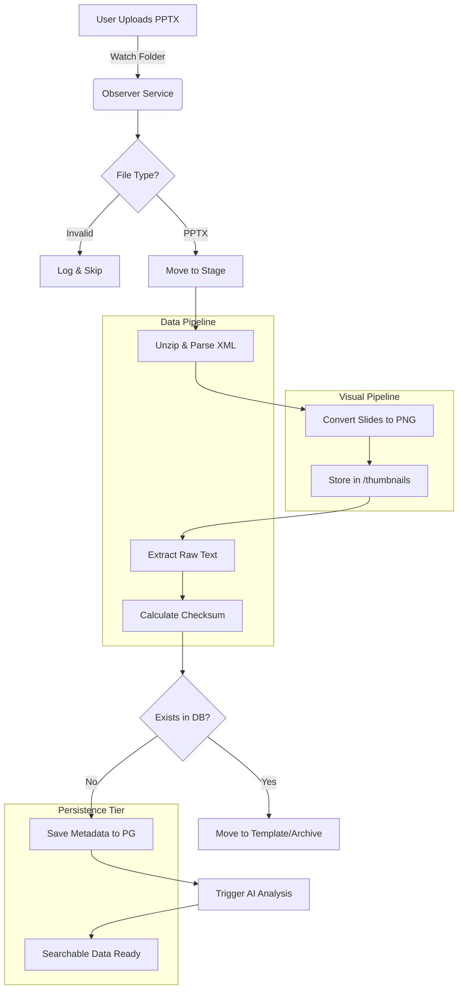

# System Process Flow

This diagram illustrates the end-to-end lifecycle of a presentation file within the SlideForge ecosystem.

## Data Transformation Pipeline

1.  **Binary Content**: The raw `.pptx` file is unzipped and analyzed.
2.  **Visual Layer**: Each slide is rendered to image for UI previews.
3.  **Semantic Layer**: AI models (Gemini/OpenAI) generate summaries and tags.
4.  **Vector Layer**: Content is embedded for similarity search.
