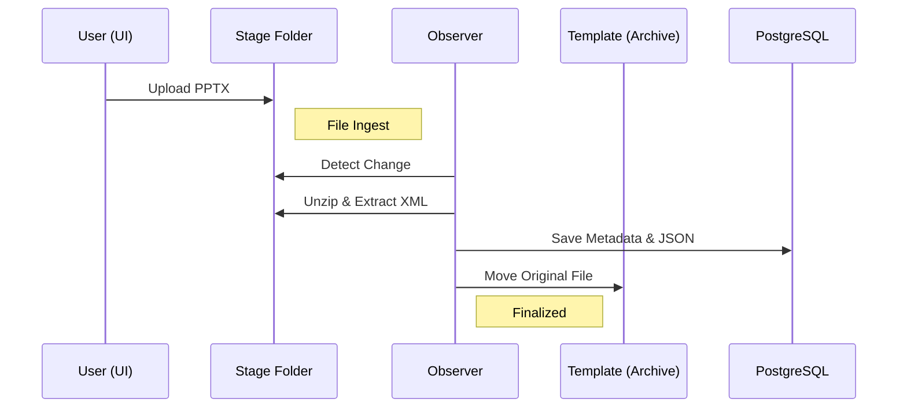
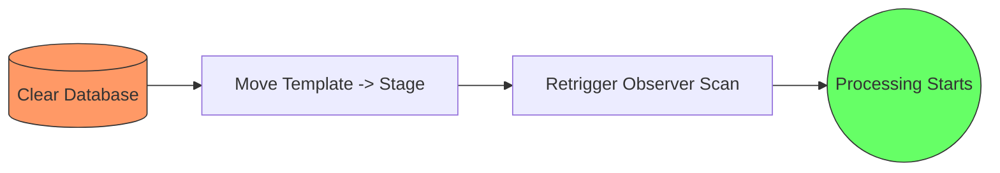

# SlideForge Workflow

SlideForge is a metadata-driven AI orchestrator for PPTX assets. It follows a strict ingestion and processing pipeline.

## Ingestion Pipeline

## Atomic Reprocessing

When a system reset is triggered, SlideForge performs a three-step atomic restoration:

## Internal Storage Architecture

SlideForge organizes data into three distinct layers:

1.  **Stage (`/stage`)**: The entry point. Files here are ephemeral and removed after successful processing.
2.  **Template (`/template`)**: The vault. Processed original files are archived here for reference.
3.  **Thumbnails (`/thumbnails`)**: The visual cache. Contains rendered images of slides, organized by presentation.

## Core Processing Steps
1.  **XML Discovery**: Unzips the PPTX package to locate slide definitions.
2.  **Text Collection**: Extracts human-readable text while maintaining slide order.
3.  **JSON Mapping**: Converts slide structures into queryable JSON for the database.
4.  **Visual Imaging**: Generates high-fidelity PNGs for the dashboard.
5.  **AI Insight**: Triggers multimodal analysis via Gemini or OpenAI.
