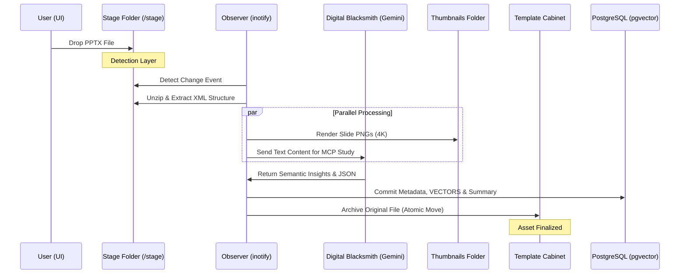
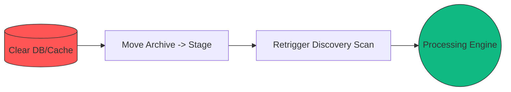

# ⚙️ SlideForge Workflow: The Forensic Pipeline

SlideForge is built on an atomic, event-driven architecture that transforms unstructured PowerPoint presentations into highly queryable metadata assets.

## 🏗️ The Ingestion Pipeline

Our "Forensic Ingestion" process ensures that every asset is treated as a unique entity, with visual and semantic preservation.

## 🔄 Atomic System Restoration

SlideForge supports high-speed re-indexing of the entire vault through an atomic restoration workflow:

## 📁 Integrated Storage Architecture

SlideForge organizes the foundry into three distinct layers, optimized for cloud synchronization:

1.  **Incoming Stage (`/stage`)**: The ephemeral landing zone. Files are moved here for ingestion and automatically cleared upon success.
2.  **Asset Archive (`/template`)**: The vault. Contains exact copies of the original processed files, managed by the catalog IDs.
3.  **Visual Cache (`/thumbnails`)**: High-performance PNG repository. Contains rendered snapshots of every slide, served to the Dashboard.

## 🧪 Core Processing Stages

1.  **XML Decomposition**: Unpacks the `.pptx` (ZIP) to extract the underlying slide definitions.
2.  **Multimodal Analysis**: Triggers the **Digital Blacksmith** to generate semantic summaries and identify key business topics.
3.  **Vectorization**: Converts slide text into high-dimensional vectors for similarity searching.
4.  **Forensic Capture**: Renders every slide as a hi-res PNG, ensuring the visual context is never lost.
5.  **Database Orchestration**: Ties all assets together with a single, queryability-optimized record.

---
*2026 | SlideForge | Part of the Antigravity Intelligence Ecosystem*
